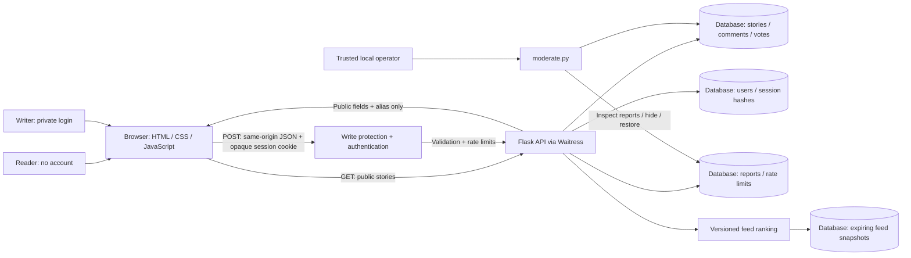
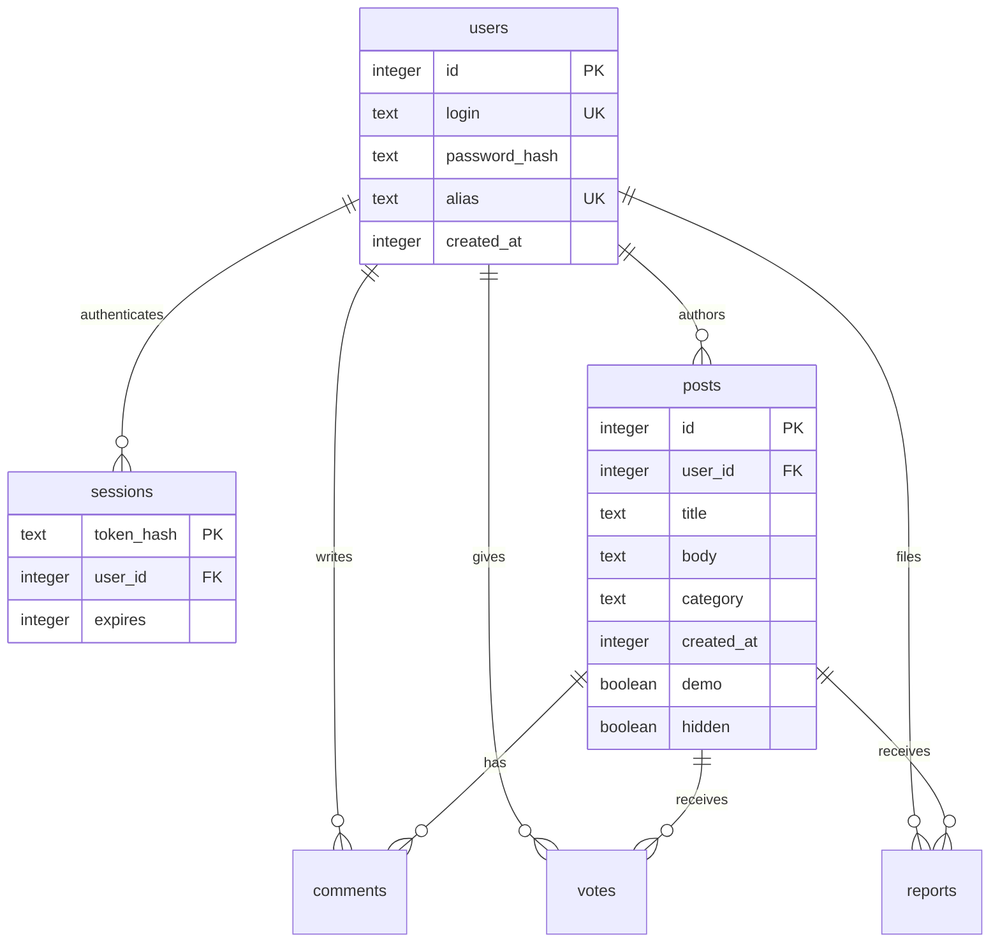

# High-level design — Abuse Your Manager

Date: 2026-10-02. Status: implemented local MVP; not deployed. This document lets the owner review the boundaries and decide what to change before a public launch. No human approval is inferred.

## Implemented system (code-verifiable facts)



The cylinders are logical groups inside **one database**, not separate services or separate trust domains. SQLite is used locally; managed PostgreSQL is used for Vercel. [Open the standalone diagram](hld.svg).

## Production database choice and justification

**Decision: managed PostgreSQL for production, with SQLite retained for local development.** The application adapter and initial PostgreSQL migration are implemented; cloud provisioning and migration application remain separately verified deployment steps.

Google Identity Services is an optional authentication path. The browser receives a Google ID token and the Flask API verifies its signature, audience, issuer and expiry with Google's official library. Only a one-way internal key derived from Google's stable subject identifier is retained; profile name, email and photo are discarded. Existing private-login accounts remain supported, and both paths receive random public aliases.

| Requirement | Why PostgreSQL fits |
|---|---|
| Evolving personalized feed | Accounts, posts, interactions, regional preferences and moderation have explicit relationships. SQL lets us revise candidate joins and aggregation without changing the client contract. This is design judgment based on our data model. |
| Partial-title search | `pg_trgm` supports indexed non-prefix `LIKE`/`ILIKE`. Very short queries without extractable trigrams may still scan, so benchmark and bound results. [PostgreSQL documentation](https://www.postgresql.org/docs/current/pgtrgm.html) |
| Geographic relevance | Start with private, optional city/region IDs. If distance-based retrieval becomes necessary, PostGIS `ST_DWithin` supports indexed spatial filtering. Exact user GPS is unnecessary for the initial design. [PostGIS documentation](https://postgis.net/docs/ST_DWithin.html) |
| Consistency and operations | A relational system of record keeps identities, unique votes, moderation state and interaction records together. Proposed production work includes migrations, a bounded connection pool, backups and restore tests. These operations are not yet provisioned. |

**Firebase is not ruled out as a platform.** Firebase SQL Connect is backed by managed Cloud SQL for PostgreSQL and can be evaluated if we prefer Google's ecosystem. Firestore Enterprise documents native text search and geographic querying, with geography marked Preview in the reviewed documentation. Our preference for PostgreSQL is about this application's relationships and changing ranking requirements, not a claim that Firestore cannot search. [SQL Connect](https://firebase.google.com/docs/sql-connect), [Firestore text search](https://firebase.google.com/docs/firestore/enterprise/text-search), [Firestore geo queries](https://firebase.google.com/docs/firestore/enterprise/geospatial-query).

SQLite keeps this local MVP easy to run. Before production, compare managed Postgres providers on region, cost at expected traffic, extensions, pooling, backups and restoration. [The production plan](PRODUCTION-PLAN.md) contains the staged migration, regional feed, interaction model and rollback gates.

### Read path

The default page shows the feed immediately beneath a persistent header search field. The decorative terminal heading, Feed/Search tabs, Feed label, Account header action, and Popular threads sidebar have been removed. Typing a partial title displays search results; clearing it restores the ranked feed. Search never alters the feed-ranking policy, and in-flight responses are invalidated when changing views.

`GET /api/popular` returns up to five visible threads ordered by votes plus distinct replying accounts, with recency/ID tie-breaking. Repeat replies from the same account do not inflate rank. Counts shown are real; if there is no engagement, the response explicitly uses an opening/recent-threads mode instead of claiming the starter stories are popular. This is an all-time basic popularity list, not a regional or recent-activity trend model.

`GET /api/feed` ranks up to 500 recent visible candidates with the versioned freshness/support policy in `feed.py`. The ordered IDs are stored as 15-minute snapshots, capped at 1,000 records. Opaque cursors paginate a stable order while rechecking moderation state on every page. A refresh builds a new snapshot; expired cursors return 410 and a refresh action. This is a global baseline: region and history features are proposed in [the production plan](PRODUCTION-PLAN.md), not collected or applied yet.

The browser opens directly to the story feed and requests `/api/feed`. The server returns only explicit public columns. The header search requests `/api/posts?q=...`, matching literal substrings anywhere in the title, not the body (SQLite LIKE is case-insensitive for ASCII letters). Percent signs, underscores and backslashes are escaped as literal search characters. Feed pages contain up to 20 visible stories. There is no intro, user-facing sort, category navigation, category badge or category selection. Legacy category/API sort parameters remain on the search/list endpoint for compatibility; the ranked feed ignores them. New uncategorized posts default to General. `/post/:id` is a shareable browser entry point; its JSON comes from `/api/posts/:id`. Hidden stories return 404. Comments are public, oldest-first, capped at 200 per detail response.

### Write path

```mermaid
sequenceDiagram
    participant B as Browser
    participant A as Flask API
    participant D as SQLite
    B->>A: POST /api/auth/signup (private login, password)
    A->>A: Validate; rate limit; scrypt hash; random alias
    A->>D: Store user and hashed opaque session token
    A-->>B: HttpOnly SameSite cookie; public alias
    B->>A: POST /api/posts (cookie + JSON + custom header)
    A->>A: Reject cross-origin; authenticate; validate; rate limit
    A->>D: Insert post tied to internal user ID
    A-->>B: New story ID
    B->>A: GET /api/posts/:id
    A-->>B: Public story + alias, never login/password/session
```

### Data model



`votes(post_id,user_id)` has a composite primary key. Setting a vote true twice does not double-count. `reports(post_id,user_id)` is unique. Database foreign keys are enabled per connection. Feed and comment indexes support common reads. No denormalized engagement counts are stored.

### API surface

| Route | Access | Purpose |
|---|---|---|
| GET `/api/me` | Public | Current alias or null |
| POST `/api/auth/signup`, `/api/auth/login` | Public, rate limited | Create session |
| POST `/api/logout` | Current cookie | Revoke current session |
| GET `/api/posts` | Public | Search/filter/sort/paginate |
| GET `/api/feed` | Public, first-page refresh rate limited | Versioned ranking and stable snapshot cursor |
| GET `/api/popular` | Public | Visible threads ranked by votes and distinct repliers; explicit cold-start fallback |
| GET `/api/posts/:id` | Public | Story and replies |
| POST `/api/posts` | Signed in | Create story |
| POST `/api/posts/:id/comments` | Signed in | Reply |
| POST `/api/posts/:id/vote` | Signed in | Set/unset vote |
| POST `/api/posts/:id/report` | Signed in | Private moderation report |

### Identity and request boundaries

- Private login is distinct from public alias. Alias is generated once using cryptographic randomness and a uniqueness constraint; no user-supplied public identity.
- Passwords use Werkzeug's scrypt hash/check functions [S002]. Raw passwords are neither logged nor stored.
- Random 256-bit bearer session tokens are stored only as SHA-256 hashes in the database. Sessions expire after seven days. Logout deletes the server record, so replaying the old cookie fails.
- Mutation endpoints require JSON and `X-Requested-With: AYM`. They reject mismatched Origin and cross-site fetch metadata. No CORS allowance is configured. Browser same-origin enforcement protects the custom-header requirement; this is not authentication for non-browser clients.
- HttpOnly and SameSite=Lax cookies are always set. Secure cookies and HSTS are opt-in for HTTPS. Flask documents cookie flags and the need for application-level CSRF defenses [S001].
- User text is escaped before DOM insertion. SQL is parameterized. CSP permits only same-origin assets and disables framing; there are no inline scripts or third-party runtime requests.
- Basic contact-detail screening rejects common email addresses and 10+ digit number patterns. It cannot reliably detect names, employers, threats or every form of personal data. Human review remains necessary.

### Explicit limits

| Control | Current value |
|---|---|
| Request body | 20 KB |
| Login attempts + signup | 20 / remote address / 15 minutes |
| Stories | 5 / account / hour |
| Replies | 30 / account / hour |
| Reports | 20 / account / hour |
| Story length | Title 8–160; body 20–5,000 characters |
| Reply length | 2–2,000 characters |
| Feed page | 20 posts |

Rate-limit keys are hashed and expired buckets are deleted on later writes. An unsalted hash of an address is not a strong privacy guarantee. Account creation controls are basic; this is not comprehensive bot/Sybil protection. The local server does not trust forwarded IP headers. A reverse proxy must have a separately reviewed client-IP policy.

## Design reasoning

One app and one database make a small community inexpensive to run and easy to inspect. There are no distributed transactions, queues, AI services, analytics, or remote identity dependencies. The framework handles HTTP while the application explicitly handles account semantics and moderation.

The current visual language is terminal-inspired: locally hosted IBM Plex Mono throughout, warm charcoal surfaces, subdued olive accents, a pill-shaped header search field and a continuous centered feed. It retains normal clickable controls, readable spacing and accessible dialogs rather than emulating an actual command shell. There are no decorative scanlines, typing animations or flashing cursors. Title-only partial search remains; the decorative intro, tabs, category UI, Feed label and sidebar are removed. A playful coffee-mug SVG is the brand mark and favicon.

## Future options — proposed, not implemented

- Public hosting: HTTPS reverse proxy, `AYM_HTTPS=1`, exact `TRUSTED_HOSTS`, edge connection limits, resource limits and access-log retention policy. The launcher currently binds only to loopback.
- Reliability: encrypted backups via SQLite backup API, restore exercise, storage monitoring and one persistent host. Do not copy a live WAL database file alone.
- Growth: migrate to Postgres when concurrent writes or multiple app instances require it; use shared rate-limit storage and cursor pagination when measurements justify them.
- Account lifecycle: recovery without workplace identity disclosure, account deletion, content deletion/editing, and an explicit retention policy.
- Moderation: staffed review queue, comment-level reports, operator action audit log and appeals; automated screening is only supplementary.
- Accessibility/quality: additional assistive-technology testing, broader browser coverage and a real user design review.

No public scale, legal compliance, zero-identification guarantee or production reliability is claimed. These options are planning assumptions, not tested capabilities.
