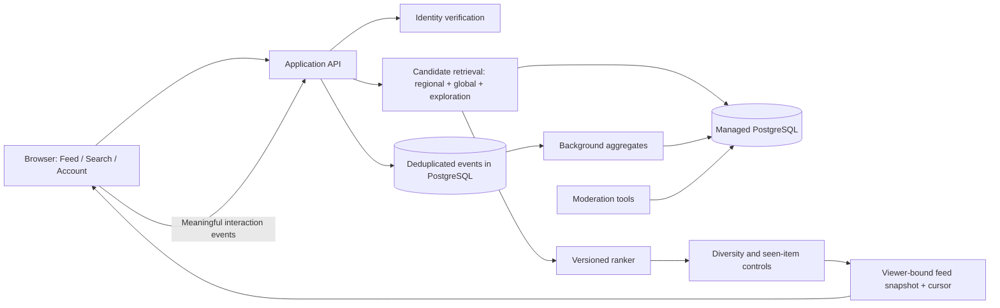

# Production plan: evolving regional and personal feeds

Date: 2026-10-02. Status: PostgreSQL adapter, reviewed migration, Vercel configuration, health check, and CI prepared. Database provisioning and deployment remain gated external actions.

## Recommendation (reasoned design judgment)

Choose **managed PostgreSQL as the system of record**, with the feed ranked behind our API. Keep identity providers independent from the post database. Firebase is still an option for managed authentication; Firebase SQL Connect is a PostgreSQL-backed alternative if staying in Google's ecosystem matters.

This application naturally relates accounts, posts, interactions, locations, moderation actions and feed experiments. PostgreSQL lets us change these joins and ranking features without making the browser depend on a storage-specific query. We do not need a second document database, a vector database or a learned recommender for the first release.

### Verified provider facts

| Option | Relevant facts | Assessment for this project |
|---|---|---|
| Managed PostgreSQL | `pg_trgm` indexes can support non-prefix `LIKE`/`ILIKE` searches. Patterns with no extractable trigrams may still scan. [S009](https://www.postgresql.org/docs/current/pgtrgm.html) | Strong fit for current partial-title search, related interaction data and evolving ranking. |
| PostgreSQL + PostGIS | `ST_DWithin` supports distance queries and uses available spatial indexes. [S010](https://postgis.net/docs/ST_DWithin.html) | Useful if we later need regional proximity. A normalized city/region ID is enough for the first regional feed. |
| Firestore Standard | Firebase's documented geohash solution combines queries and filters false positives. [S006](https://firebase.google.com/docs/firestore/solutions/geoqueries) | Feasible, particularly for fixed city equality filters; not the default I would choose for this relational feed. |
| Firestore Enterprise | Native text search is documented; geospatial querying requires Enterprise and is marked Preview as checked today. [S007](https://firebase.google.com/docs/firestore/enterprise/text-search), [S008](https://firebase.google.com/docs/firestore/enterprise/geospatial-query) | More capable than older comparisons suggest. Must validate edition, matching semantics, SDK support and costs rather than claiming Firestore cannot search. |
| Firebase SQL Connect | Managed PostgreSQL via Cloud SQL, with GraphQL-defined operations, generated SDKs and Firebase Authentication integration. The former Data Connect URL currently redirects here. [S011](https://firebase.google.com/docs/sql-connect) | A credible Firebase route; compare its operation model against keeping our existing Flask API directly on managed PostgreSQL. |

Provider selection should compare an India/nearby region, backups and restore support, connection limits/pooling, idle and steady-state costs, and extension support. No quote or cost forecast is inferred without expected traffic. Run a representative feed/query benchmark before committing to a provider or migrating real data.

## Implemented in this step

- One **Account** entry in the header; authentication remains at the write boundary. Existing login/registration happens inside the account dialog, not as competing homepage actions.
- Removed Latest/Most relatable controls. Feed is a server-ranked product surface; Search remains separate.
- New `GET /api/feed`, independent from title search at `GET /api/posts?q=...`.
- `feed.py` defines `freshness-support-v1`: recency plus logarithmic, capped unique vote support with age decay. Raw reply counts do not improve rank, so comment arguments are not automatically rewarded.
- Candidate retrieval considers the newest 500 visible posts; this is an explicit local limit, not a production claim.
- Each first-page request freezes ranked public post IDs into a 15-minute snapshot. Opaque cursors advance through it, preventing rank changes from duplicating or skipping items during that scroll. Visibility is rechecked when serving every page.
- At most 1,000 snapshots are retained; oldest snapshots can expire early under pressure. Expired cursors return 410 and the UI offers refresh. Snapshot creation is limited to 60 per remote address per minute.
- Snapshots currently contain only globally ranked public IDs, not user history. Before personal ranking, bind snapshots to the viewer and stop sharing them across identities.

This is a **global baseline**, not geographic or personalized ranking. No GPS, IP-to-city lookup, click history or inferred interests are collected by this step. SQLite remains the local store; production uses PostgreSQL through `DATABASE_URL`.

## Target HLD (proposed)

The database is not the recommendation algorithm. Candidate retrieval limits what is considered; the ranker decides the order; the snapshot preserves that order for one scrolling session. Keep a policy version and feature version on experiments so we can explain and roll back changes.

## Next slices and acceptance gates

### 1. Persistence and deployment foundation

Introduce a database access layer and versioned migrations, then migrate the local schema to managed PostgreSQL in staging. Keep auth IDs, public aliases and content IDs stable. Put indexes on actual feed/filter/join paths; verify representative plans rather than indexing every field. Use a small connection pool matched to provider limits.

Deliverable: staged schema and migration, synthetic dataset, row-count and relationship reconciliation, backup/restore exercise, rollback procedure, deployment configuration, HTTPS-only cookies, trusted hosts, and API health checks. The existing SQLite startup `CREATE TABLE IF NOT EXISTS` approach is not a production migration system.

### 2. Geographic relevance

Start with an **optional user-selected city/metro area**, privately stored. Posts may optionally target a region; do not infer an author's workplace or expose their location. Region IDs and parent-region relationships support broadening from city to surrounding region to global supply. No exact GPS is necessary.

Deliverable: canonical regions, optional viewer preference, optional post region, local/global candidate mixture and a sparse-region fallback. Anonymous readers who decline a region receive the global baseline. A new city must never produce an empty feed or reveal an individual's location through a tiny cohort.

### 3. Interaction history and transparent controls

Add `interaction_events` with a server-generated viewer/account binding, post ID, event kind, time, unique client event key and feed-policy version. Start with explicit likes, hides and saves; treat opening a post as a weak signal, not proof of preference. Validate that the referenced story exists and is visible. Deduplicate retries and cap repeated activity.

For logged-out readers, offer device-local personalization or an opt-in pseudonymous cookie; no browser fingerprinting. Account history works across devices after authentication. Provide a reset/disable control and a documented retention period before collection starts.

Deliverable: event ingestion, deletion/reset, aggregation job and tests showing duplicate events cannot inflate preferences. Avoid using interaction with an allegation as evidence that the reader endorses it.

### 4. Personalized ranking, behind a rollout flag

Retrieve a bounded mix of regional candidates, interest-related candidates and global exploration. Score recency, region affinity, meaningful interaction similarity and trusted engagement. Apply moderation exclusions, seen-item penalties, author diversity and exploration. Explicit hides should dominate positive affinity. Keep cold-start behavior on the global/regional baseline.

The legacy category field is not a usable interest model: new posts are General. Introduce reviewed internal topic features or text similarity with a defined feature version; no category controls need to return to the UI.

Deliverable: repeatable ranking fixtures, shadow evaluation, small controlled rollout and one-step rollback. Start with rules and weights; consider learned ranking only after reliable events and sufficient data exist.

## Proposed relational model

| Entity | Main relationship / constraint | Purpose |
|---|---|---|
| accounts + auth identities | One public alias; provider subject unique | Separate login mechanism from public identity |
| regions | Stable key, optional parent region | Geographic candidates without precise user coordinates |
| viewer preferences | Account/device reference; optional region; personalization flag | Explicit choices and reset |
| posts | Author reference, optional region, moderation state | Searchable public content |
| interaction events | Viewer + unique event key; post reference; event type/time | Retry-safe evidence |
| viewer feature aggregates | Viewer + feature version + feature key unique | Bounded, rebuildable preferences |
| post feature aggregates | Post + feature version unique | Avoid recomputing all engagement for every read |
| feed snapshots | Viewer binding, policy version, expiry, ordered candidates | Stable per-viewer pagination |
| moderation actions | Operator, action, target, reason, timestamp | Accountable review and appeals |

Use regional/recent-post indexes and viewer/time indexes for events; choose text indexes for actual substring search. Confirm PostGIS availability only if radius queries become a requirement. This table is a proposal, not an applied schema.

## What improves as users grow

Measure eligible regional supply, returning readers, meaningful positive feedback, hides/reports per impression, repeat-author saturation, feed latency and per-session query cost. Use those observations to expand candidate pools and tune policies. User count alone should not silently change the algorithm.

Sparse community: freshness and global supply. Enough local supply: regional weighting. Enough history: modest interest boosts plus exploration. More traffic: cached aggregates and background computation. Add a shared cache/queue only when profiling shows a need; the first database should remain the source of truth.

## Launch boundary

Before public launch: establish staffed moderation, account recovery/deletion, retention and privacy controls, backups, abuse limits, secret management and observability without logging private story drafts or credentials. Load-test the feed and verify that moderated posts disappear from existing snapshots. Current snapshot capacity, candidate limit and SQLite writes are local MVP constraints.
